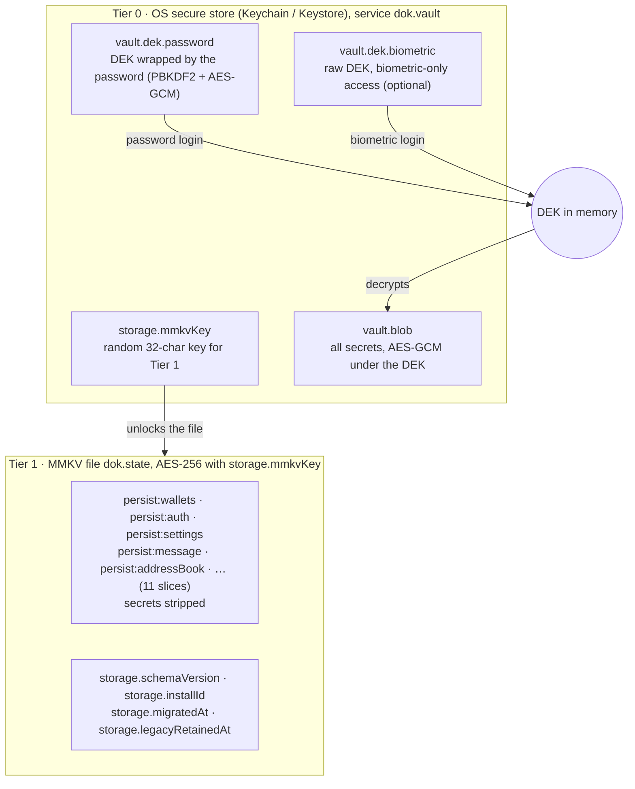
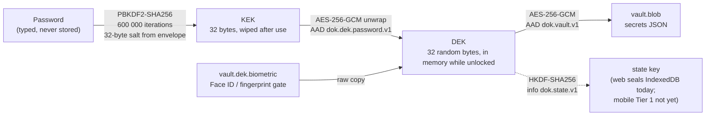
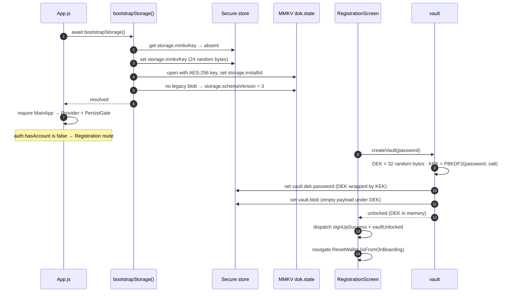
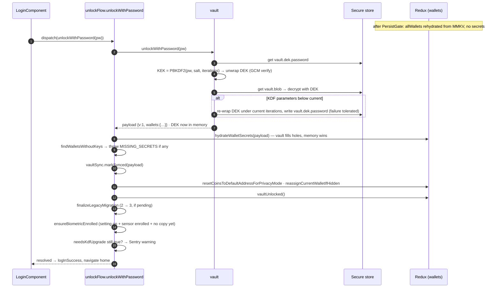
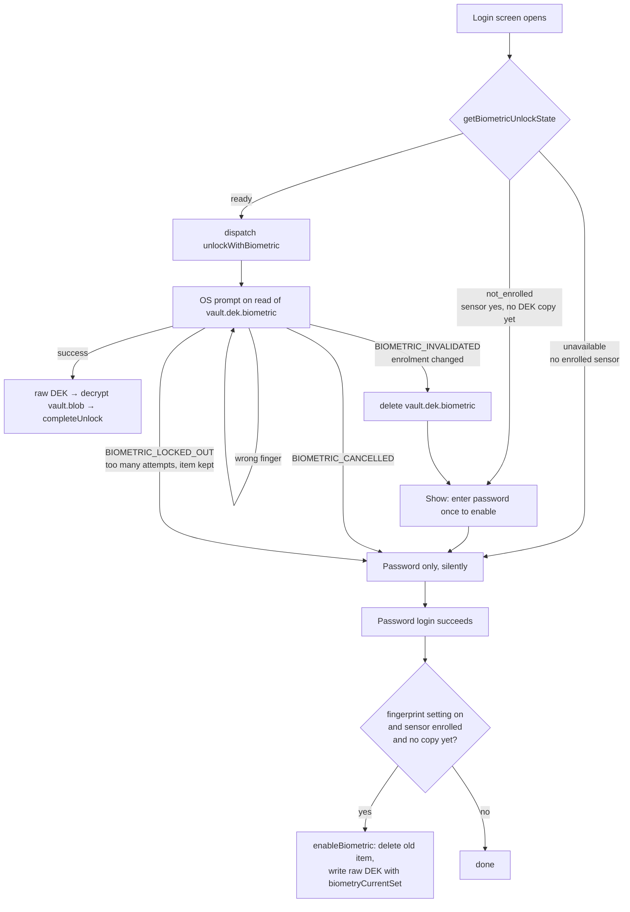
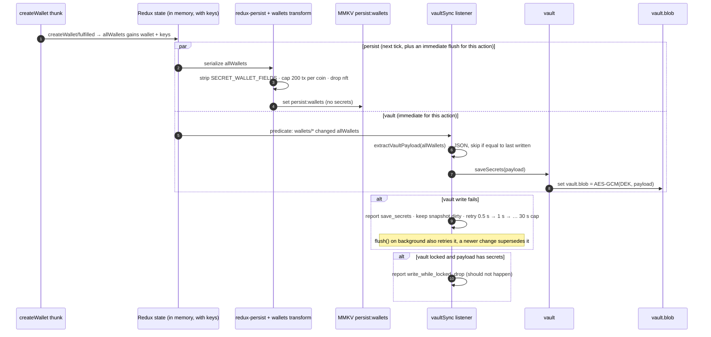
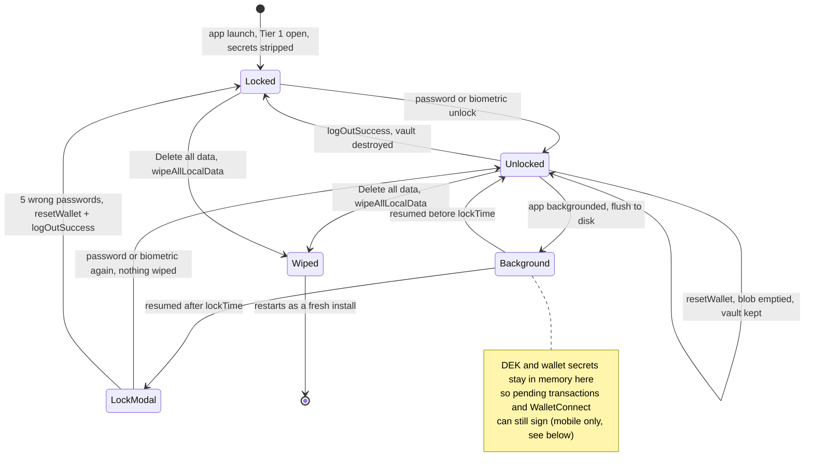
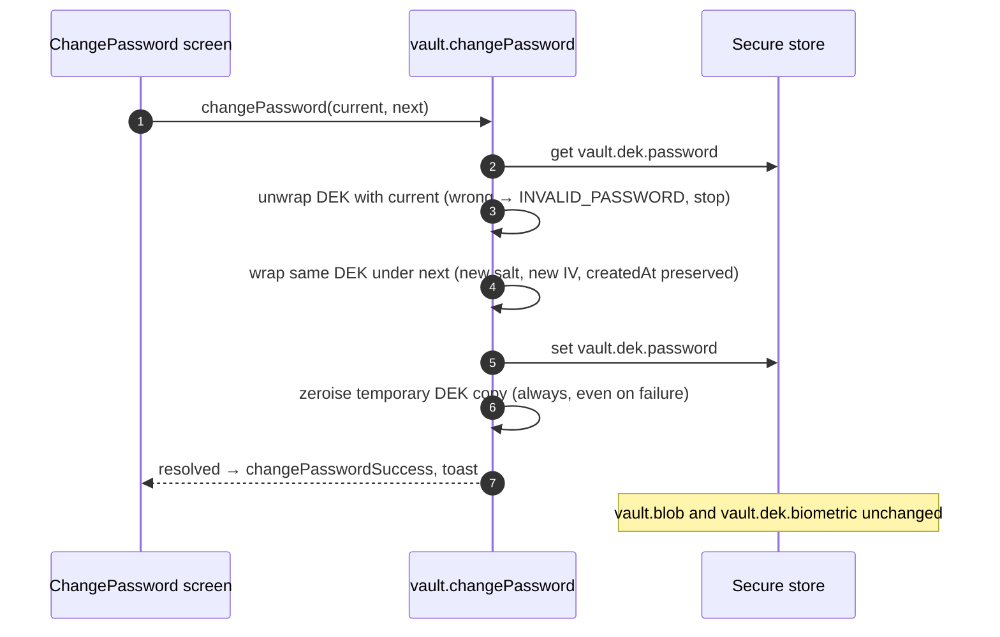
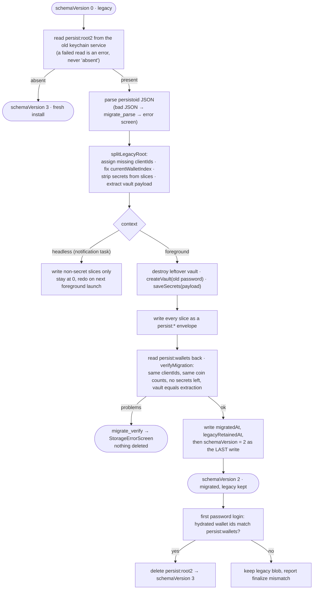

# How the secure wallet storage works (mobile)

A plain-English walkthrough, with diagrams, of how DOK Wallet / KIML Wallet
stores wallet secrets on iOS and Android after the vault-v2 change: how login
works, where every piece of data lives, what happens on lock, logout, reset
and upgrade, and what an attacker can and cannot get.

Audience: developers on the team. Every section starts with the idea in plain
words, then a diagram, then a short "for developers" list with the real file,
function and key names so this doubles as a code map. Web is mentioned only
where it behaves differently. The decision records behind this design are in
`docs/superpowers/specs/2026-09-18-secure-storage-redesign.md`,
`…-amendments.md` and `2026-09-19-secure-storage-final-plan.md`.

Glossary, used throughout:

| Term | Meaning |
|---|---|
| **Secret** | A wallet mnemonic (`phrase`), a private key, an extended private key, a derive-address key, or the hidden-wallet code hash. Anything that can sign or reveal funds. |
| **DEK** | Data Encryption Key. 32 random bytes that encrypt the secrets blob. Lives only in memory while unlocked. |
| **KEK** | Key Encryption Key. Derived from the password on every login; used only to unwrap the DEK, then wiped. |
| **KDF** | Key Derivation Function. Here PBKDF2-HMAC-SHA256 with 600 000 iterations and a 32-byte salt. Turns a password into a KEK slowly, on purpose. |
| **AES-GCM** | The cipher used everywhere. Encrypts and also authenticates: if a single byte of ciphertext or of the wrong key is used, decryption fails loudly instead of returning garbage. |
| **AAD** | Additional Authenticated Data. A purpose label baked into every ciphertext (`dok.dek.password.v1`, `dok.vault.v1`, `dok.state.v1`) so a ciphertext for one purpose can never be replayed as another. |
| **Secure store** | iOS Keychain / Android Keystore, accessed through react-native-sensitive-info 6 (RNSI, a Nitro module), under our own service `dok.vault` (`SECURE_STORE_KEYCHAIN_NAME`). |
| **MMKV** | A fast key-value file store. We use one instance, `dok.state`, encrypted with AES-256, for the Redux slices. |
| **Envelope** | The JSON shape a ciphertext is stored in: `{v, cipher, iv, ct, aad}` plus KDF parameters for the password wrap. |

---

## 1. The idea in one minute

Think of two containers.

- **The safe** is the vault. It holds every secret, encrypted with a random key
  (the DEK). The only ways to open the safe are the user's password or, if they
  turned it on, their face or fingerprint. The app never stores the password.
- **The locked room** is the MMKV file. It holds everything else the app
  remembers: wallet names, addresses, balances, transaction history, settings.
  The room key is a random string kept by the operating system's secure store.
  Secrets are removed from every object before it goes into the room.

Before this change there was one Keychain/SharedPreferences blob that held the
whole Redux state, including the password in plain text and every mnemonic and
private key next to the public data. Anyone who could read that one item had
everything.

What the new design guarantees:

1. The password is never stored. "Correct password" means the vault key could be
   unwrapped and its authentication tag verified.
2. Secrets exist in exactly one place at rest: the encrypted `vault.blob`.
3. Guessing the password offline costs 600 000 PBKDF2 iterations per guess.
4. Changing the password re-encrypts one 32-byte key, never the secrets.
5. Corruption is detected, never silently decrypted into garbage or mistaken
   for a wrong password.
6. Upgrades from the old single-blob format are all-or-nothing: the old blob is
   kept until the new stores have been proven end to end.

---

## 2. Where everything lives

Two tiers. Tier 0 is the OS secure store, small and hardware-backed. Tier 1 is
the encrypted MMKV file, larger and fast. Nothing in Tier 1 can sign a
transaction.



| Item | What is inside | Who can read it | When it changes |
|---|---|---|---|
| `storage.mmkvKey` | 24 random bytes, base64 (32 chars, MMKV's max) | The app, any time it runs | Created on first launch; deleted by Delete-all-data |
| `vault.dek.password` | Envelope with `kdf {alg, iterations, salt}`, `iv`, `ct` (DEK + tag), `createdAt`, `updatedAt` | The app; useful only with the password | Registration, change password, KDF upgrade during login |
| `vault.dek.biometric` | The raw DEK, base64 | Only after the OS biometric prompt succeeds | Enabled after first password login with the setting on; deleted on disable, on enrolment change, on logout |
| `vault.blob` | Envelope of the secrets JSON `{v:1, wallets:{<clientId>: {phrase, privateKey, hideSettings, coins, chainExisting, deriveKeys}}}` | The app; useful only with the DEK | Every time wallet key material changes (see §7) |
| `persist:<slice>` | redux-persist envelope per slice, secrets removed by transforms | The app | On every state change (next tick), and flushed immediately after wallet-creating actions and reset |
| `storage.schemaVersion` | `0` legacy, `2` migrated, `3` finalized | The app | Migration steps (see §10) |

**For developers**

- Tier 0 adapter: `src/security/secureStore.js` (`get`, `set`, `remove`, `has`, `getFromService`, `isBiometricAvailable`). Keychain service is `SECURE_STORE_KEYCHAIN_NAME`, default `dok.vault`, separate from the legacy `REDUX_KEYCHAIN_NAME` and the App Attest keys.
- Tier 0 keys: `VAULT_KEYS` in `dok-wallet-blockchain-networks/security/vault.js`; `STORAGE_KEYS.mmkvKey` in `src/redux/storage/bootstrap.js`.
- Tier 1: `src/redux/storage/bootstrap.js` (`STATE_MMKV_ID`, `openStateStore`), `src/redux/storage/mmkvStorage.js` (redux-persist adapter).
- Stripping: `SECRET_WALLET_FIELDS` and `stripAllWalletsSecrets` in `dok-wallet-blockchain-networks/redux/wallets/walletSecrets.js`; applied by `createWalletsPersistTransform` in `redux/storage/persistTransforms.js`. Limits: `WALLET_PERSIST_LIMITS` (200 transactions per coin, 100 messages per conversation), no NFT cache.

---

## 3. The key hierarchy

The password never encrypts the secrets directly. It derives a KEK, the KEK
unwraps the DEK, the DEK decrypts the blob. That extra hop is what makes
"change password" cheap and lets a biometric copy of the DEK coexist with the
password copy.



Why each piece is there:

- **Slow KDF.** A stolen `vault.dek.password` item is only as strong as the
  password, so each guess is made to cost 600 000 hash rounds. The iteration
  count travels inside the envelope, so it can be raised later: on a password
  login the vault sees the old count and re-wraps under the new one.
- **Random DEK.** The secrets are encrypted under a key with full 256-bit
  entropy, not under something derived from the password. Changing the password
  re-wraps only these 32 bytes; the blob is byte-for-byte unchanged.
- **GCM everywhere.** A wrong password or a flipped byte fails authentication.
  There is no path that returns partially decrypted data.
- **AAD purpose labels.** The DEK wrap, the blob and the state key each carry a
  different label. Feeding the DEK envelope to the blob decryptor is rejected
  before any crypto runs.
- **Fresh IV and salt every time.** Two wraps of the same DEK under the same
  password produce different ciphertexts.

**For developers**

- Pure crypto and envelope rules: `dok-wallet-blockchain-networks/security/vaultCore.js` (`wrapDek`, `unwrapDek`, `encryptBlob`, `decryptBlob`, `deriveStateKey`, `encryptString`, `decryptString`, `isKdfStale`). Constants: `KDF_ITERATIONS`, `SALT_BYTES`, `IV_BYTES`, `GCM_TAG_BYTES`, `AAD`.
- Platform primitives: `src/security/vaultCrypto.js` on react-native-quick-crypto (`pbkdf2` in callback form so 600k rounds run off the JS thread, `hkdf`, `aesGcmEncrypt`, `aesGcmDecrypt`).
- Error codes: `VAULT_ERROR_CODES` in `security/errors.js`. Wrong password → `INVALID_PASSWORD` (only from the DEK wrap). Bad blob or state item → `CORRUPT_ENVELOPE`. Wrong purpose or version → `UNSUPPORTED_ENVELOPE`.
- Cross-platform proof: `security/__fixtures__/vault.v1.json` is decrypted in both apps' Jest runs. Never edit it in place.

---

## 4. Scenario: first launch and registration

On a fresh install there is nothing to migrate. Boot creates the MMKV key and
file, marks the schema finalized, and the user lands on Registration. Choosing
a password creates the vault: a new DEK, wrapped under that password, and an
empty blob. The vault is left unlocked so onboarding can create the first
wallet straight away.



**For developers**

- `App.js` calls `setBootstrapContext('foreground')` then `bootstrapStorage()`; only on success does it `require('components/MainApp')`, so `redux/store` is never evaluated before the store is open. Failure renders `src/components/StorageErrorScreen.js` with a retry.
- Boot order in `src/redux/storage/bootstrap.js`: `migrateAndroidLegacySharedPreferences` (Android only) → `detectReinstall` → `getOrCreateMmkvKey` → `openStateStore` → `runMigrations`.
- Registration: `src/screens/auth/RegistrationScreen/index.js` destroys a leftover vault first (`hasVault` → `destroy`), then `vault.createVault`.
- Routing reads `getHasAccount` (`auth.hasAccount`), never a stored password.

---

## 5. Scenario: normal launch and password login

Every launch opens Tier 1 first and shows the app with secret-stripped wallets
behind the login screen. The password unlocks the vault, the secrets are merged
back into the in-memory wallets, a few consistency checks run, and only then is
the app marked unlocked. The vault also uses this moment, when the password has
just proved itself, to upgrade old KDF parameters in place.



Failure branches the Login screen handles:

| Error code | Meaning | What Login does |
|---|---|---|
| `INVALID_PASSWORD` | GCM tag on the DEK wrap did not verify | Counts an attempt (`handleAttempts`); five failures reset the wallet and log out |
| `MISSING_SECRETS` | A persisted wallet has no key in the vault | Blocks with a message to restore from seed phrase; does not count as an attempt |
| `CORRUPT_ENVELOPE`, `unavailable`, anything else | Storage or crypto problem, not the user's password | Blocks with "secure storage is unavailable, restart the app"; does not count as an attempt |

**For developers**

- `src/security/unlockFlow.js`: `unlockWithPassword`, `completeUnlock`, `findWalletsWithoutKeys`, `ensureBiometricEnrolled`, `isInvalidPassword`.
- `dok-wallet-blockchain-networks/security/vault.js`: `unlockWithPassword` reads the blob and does the KDF re-wrap before `setDek`, so a failure anywhere leaves the vault locked with the unwrapped key zeroised. A failed re-wrap write is swallowed (old wrap still valid) and reported by the thunk via `needsKdfUpgrade`.
- Hydration: `hydrateWalletSecrets` in `walletSecrets.js`, reducer `walletsSlice.hydrateWalletSecrets`. Matching is by `clientId`, coin key, chain name and derive path or address. Memory always wins; `undefined` is never written.
- Ordering rule: the privacy-mode reset must run after hydration, because it moves a coin's address and key together.
- Login UI: `src/components/LoginComponent/index.js`.

---

## 6. Scenario: biometric login

Biometrics do not replace the password; they hold a second copy of the DEK
behind the OS prompt. The copy is created only after a successful password
login, only when the setting is on and a sensor is enrolled, and only in the
foreground. If the user changes their enrolled face or fingerprint, the OS
destroys the copy and the app falls back to the password once.



Three rules that look odd until you know why:

- **One prompt at a time, and no automatic re-prompt after a cancel or a
  failure.** `LoginScreen` and `LoginModal` both mount the Login component,
  and both used to prompt on mount and on every return to the foreground. The
  OS prompt, and Android's PIN-based sensor recovery after a lockout, pause
  and resume the app, so each round trip re-triggered a prompt: prompt → PIN →
  prompt, forever. A shared gate (`security/biometricPromptGate.js`) allows one
  prompt in flight, debounces re-prompts, and after a cancel or a terminal
  failure only a fresh Login mount or the "Use fingerprint / face unlock"
  button prompts again.

- **Enrolment never happens during migration or at boot.** On Android react-native-sensitive-info shows the BiometricPrompt on every biometric-protected write (the Keystore key needs authentication); iOS 6.x writes the Keychain item without a prompt, but its resolver silently downgrades the policy when biometrics are unavailable. Writing the copy at boot would either pop an OS dialog before the app has drawn anything or store the DEK behind a weaker gate.
- **`enableBiometric` deletes before it writes.** The Keychain keeps an existing item's access policy on update, so overwriting could silently keep an older, weaker policy.

**For developers**

- `vault.js`: `enableBiometric`, `disableBiometric`, `unlockWithBiometric`, `hasBiometric`, `isBiometricAvailable` (adapter: `FingerprintScanner.isSensorAvailable()`), `BIOMETRIC_ACCESS_CONTROL = 'biometryCurrentSet'`.
- `unlockFlow.js`: `getBiometricUnlockState`, `canUnlockWithBiometric`, `unlockWithBiometric`; prompt copy in `src/security/biometricPrompt.js`.
- RNSI 6 takes `service` and `authenticationPrompt` on both reads and writes. `src/security/secureStore.js` always sends `accessControl` (the 6.x default is `secureEnclaveBiometry`), rejects a protected write whose returned `metadata.accessControl` is weaker than requested (RNSI 6 never fails a write over an unavailable policy), and rewrites the prompt for iOS (`{title, description}`; RNSI 6 would show `subtitle` on the fallback button). No lockout error code exists in 6.x: an OS lockout reaches Login as a generic failure ("Biometric unlock is not available right now").
- The iOS simulator does not enforce Keychain access-control flags. Biometric unlock must be tested on a device.

---

## 7. Scenario: creating or importing a wallet

When a wallet is created, two writers run from the same Redux state. The
persist layer writes the wallet to MMKV with every secret removed. The vault
listener extracts the secrets and writes them to `vault.blob`. Wallet-creating
actions write to the vault immediately and are awaited, because a crash between
the two writes would otherwise leave a wallet on disk with no key. Everything
else is debounced, and a write whose payload has not changed is skipped.



**For developers**

- `dok-wallet-blockchain-networks/security/vaultSync.js`: `createVaultSync`, `IMMEDIATE_VAULT_WRITE_ACTIONS` (create wallet, batch create, add token, add coin group, toggle coin, add EVM/Tron derive addresses, add 50 addresses, custom derive address, hide settings), `VAULT_SYNC_DEBOUNCE_MS = 500`, `VAULT_SYNC_MAX_RETRY_MS = 30000`, `flush`, `markSynced`, `reset`.
- Wired in `src/redux/store.js` as `.prepend(vaultSync.middleware)`; `flush()` is called next to `persistor.flush()` when the app goes to background in `src/components/main.js`.
- Secret extraction: `extractVaultPayload` in `walletSecrets.js`, keyed by `clientId`; coins keyed by `generateUniqueKeyForChain`; EVM derive keys share one family.
- Other slices that carry coin snapshots are sanitized too: sell-crypto `selectedFromWallet`, batch-transaction `coinInfo` (including nested derive addresses), WalletConnect `walletData`.

---

## 8. Scenario: lock, background, logout, reset, delete all data

Mobile keeps the DEK and the wallet secrets in memory while the app is merely
locked or in the background, on purpose: pending-transaction polling, balance
refresh and WalletConnect requests keep signing behind the lock modal. What
changes on each event is what is written to disk and whether the vault survives.



| Event | Redux | `vault.blob` | `vault.dek.*` | MMKV | Where |
|---|---|---|---|---|---|
| Background | flushed to MMKV | flushed if dirty | unchanged | unchanged | `main.js` AppState handler |
| Lock modal after `lockTime` | unchanged | unchanged | unchanged | unchanged | `main.js` → `LoginModal` |
| Reset wallet (keep account) | `allWallets = []` | empty payload written (retried on failure) | unchanged | wallets slice persisted empty | `vaultSync` on `wallets/resetWallet` |
| Log out / Forgot password / too many attempts | auth cleared | removed | removed | slices remain until next flows overwrite | `vaultSync` on `auth/logOutSuccess` |
| Delete all data | purged | removed | removed | file deleted, `storage.mmkvKey` removed, legacy blob removed | `src/redux/storage/wipe.js` |

Web differs here: `lockSession()` on idle or logout flushes the vault, clears
secrets from the in-memory wallets, seals the IndexedDB adapter and locks the
vault. Mobile does not zeroise on lock yet (Phase 5 open item) because the
background signers above would need queueing first.

**For developers**

- Lock modal timing: `getLockTime` and `lockTimeSet` in `src/components/main.js`; the modal is `src/components/LoginModal.js` around `LoginComponent`.
- Lockout: `handleAttempts` in `dok-wallet-blockchain-networks/redux/auth/authSlice.js`, `maxAttempt` 5.
- Reset vs logout vs wipe: `ModalReset` dispatches `resetWallet` then `logOutSuccess`; `ModalDeteletData` / `delete.js` call `wipeAllLocalData({persistor})` then restart.
- `wipe.js` runs five independent steps and rethrows the first failure after attempting all: purge, vault destroy, MMKV delete, `storage.mmkvKey` remove, legacy blob remove.

---

## 9. Scenario: change password

Change password proves the current password by unwrapping the DEK, wraps the
same DEK under the new password, and writes that one item. The blob is
untouched. The lock state is untouched too: an unlocked app stays unlocked with
the same key, a locked one stays locked.



**For developers**

- `vault.changePassword` in `security/vault.js`; UI in `src/screens/auth/ChangePassword/index.js` (wrong current password → `setWrong`, other errors → toast + Sentry).
- Because the biometric item holds the raw DEK, it keeps working after a password change with no re-enrolment.

---

## 10. Scenario: upgrading from the old app version

Users coming from the single-blob format have `persist:root2` in the Keychain
or Keystore with the password and every secret in plain JSON. The first launch
of the new version converts it in one pass before the Redux store exists. The
conversion is designed so that a crash at any point redoes cleanly from the
untouched old blob, and the old blob is deleted only after the first login has
proved the new stores work.



Special cases handled on the way:

- **Wallets from before `clientId` existed.** The runtime used to backfill ids after rehydrate. Migration runs earlier, so it assigns them itself and uses the same id for the stripped slice and the vault entry; `verifyMigration` refuses any wallet still without one.
- **No password in the old state.** Onboarding was never finished. The secrets are kept in memory for this session as an orphan payload and persisted once Registration creates the vault.
- **Pre-RNSI-5 Android builds.** The blob may sit in plain SharedPreferences (`REDUX_SHARED_PREFERENCE_NAME`) instead of the Keystore-backed store. `readLegacyRoot` reads it from there directly (RNSI 6 caps writes at 1 MiB, so it is never copied across) and `removeLegacyRootBlob` clears it at finalisation.
- **react-native-sensitive-info 5.6.2 Android store.** 6.x uses a different SharedPreferences layout. `android/.../SensitiveInfoV6Migration.kt` re-shapes every unprotected 5.6.2 entry into the 6.x envelope at `Application.onCreate`, before any JS runs, without decrypting anything (same ciphertext, IV and Keystore key). The 5.6.2 file is retained for now; a marker file `rnsi_v6_migration` makes the step idempotent. iOS needs nothing: both versions store the same Keychain item.
- **Headless launch by a scheduled-payment notification.** There is no time budget for a 600 000-iteration KDF, so only the non-secret slices are written and the state machine stays at 0.

**For developers**

- Mobile driver: `src/redux/storage/migrateLegacyRoot2.js` (`readLegacyRoot` via `secureStore.getFromService`, `migrateLegacyRoot2`, `finalizeLegacyMigration`, `consumeOrphanVaultPayload`, `MIGRATION_ERROR_CODES`).
- Pure helpers shared with web: `dok-wallet-blockchain-networks/redux/storage/legacyRootMigration.js` (`parseLegacyRoot`, `ensureWalletClientIds`, `fixCurrentWalletIndex`, sanitizers, `splitLegacyRoot`, `buildPersistEnvelope`, `parsePersistEnvelope`, `verifyMigration`).
- State machine constants: `SCHEMA_VERSION` in `bootstrap.js`; `setBootstrapContext('headless')` is set in `index.js` before the store is required.
- The legacy reader, the Android SharedPreferences step and `crypto-js` on web stay until Sentry shows `storage.migration` finalized for close to all active installs.

---

## 11. When things go wrong

| Situation | What the user sees | What the code does | What is never lost |
|---|---|---|---|
| Wrong password, up to 4 times | "Invalid password, N attempts left" | `INVALID_PASSWORD` from the DEK unwrap; `handleAttempts` records it | Everything |
| Wrong password, 5th time | "Wallet deleted, too many failed attempts" | `resetWallet` + `logOutSuccess`: blob emptied then vault destroyed, back to onboarding | Nothing on device by design; user restores from seed phrase |
| `vault.blob` corrupt or tampered | "Secure storage is unavailable, restart the app" | `CORRUPT_ENVELOPE`; vault stays locked; not counted as an attempt | The DEK wrap, so the password still verifies; blob needs restore |
| Keystore/Keychain unavailable at boot | Storage error screen with Try again | `bootstrapStorage` rejects with `unavailable`; memo cleared so retry runs the full boot | Old blob and all stores untouched |
| Old blob cannot be read during upgrade | Storage error screen | Read failure is an error, never "fresh install"; schema stays 0 | Old blob |
| Upgrade self-check fails | Storage error screen | `migrate_verify`; vault locked; schema stays 0 | Old blob |
| App killed mid-upgrade | Nothing; next launch redoes it | `schemaVersion=2` is the last write; leftover vault is destroyed and recreated | Old blob |
| iOS reinstall with Keychain leftovers | Normal fresh install | MMKV file missing but a vault exists → vault and `storage.mmkvKey` destroyed | Nothing to lose; leftovers were from the removed install |
| Face/fingerprint enrolment changed | Asked for password once, then biometrics re-enabled | `BIOMETRIC_INVALIDATED`: item deleted, `not_enrolled` state, re-enrol after password login | Everything |
| Wrong finger, several times | Prompt stays open and retries; after the OS limit, "Biometric unlock is not available right now. Enter your password." | A failed match is not terminal (upstream 6.x behaviour). RNSI 6 has no lockout code, so the OS lockout arrives as an unclassified error: item kept, Sentry warning from Login's default branch | Everything |
| Android asks for the device PIN inside the prompt to recover a locked-out sensor | Same notice; no new prompt until the user taps "Use fingerprint / face unlock" or types the password | The failed-attempt counter is per sensor, so it can trip after fewer misses than expected. A prompt completed by the PIN fails the biometric-only cipher and lands in the same generic branch; the prompt gate stops the foreground handler from re-prompting during the recovery round trip | Everything |
| Vault write fails after creating a wallet | Nothing; Sentry warning | Snapshot stays dirty, retried with backoff and on background flush | Keys in memory until written; MMKV has the stripped wallet |
| Legacy wallet without `clientId` | Nothing | Id assigned during split, same id in slice and vault | Its secrets |
| Wallet on disk with no key in vault | "N wallets have no keys, restore from seed phrase" | `MISSING_SECRETS`; unlock refused; not counted as an attempt | Public data; keys must be re-imported |
| KDF upgrade write fails during login | Nothing; Sentry warning | Login proceeds under the old wrap; `needsKdfUpgrade` reported | Everything |
| Notification wakes a killed app | Nothing | Headless context: non-secret slices only, no KDF, no biometric prompt | Everything |

---

## 12. What an attacker gets

| Attacker has | Can read | Cannot read | Why |
|---|---|---|---|
| A locked phone | Nothing from the app | Both tiers | iOS `NSFileProtectionComplete` on all app files; Android Keystore keys unusable while locked; MMKV key lives in the secure store |
| A device backup or device-to-device transfer | App preferences unrelated to storage | MMKV file, secure-store items | Android `backup_rules.xml` / `data_extraction_rules.xml` exclude `mmkv/` and all SharedPreferences incl. `sensitive_info.xml`; iOS Keychain items are not in backups without the device passcode class |
| The MMKV file, e.g. from a rooted device | Nothing without `storage.mmkvKey`; with it, wallet names, addresses, balances, history, settings | Any secret | AES-256 file encryption; secrets stripped before persisting; `assertNoSecrets` audits in tests |
| All four secure-store items, no password | `storage.mmkvKey`, envelope metadata (salt, iteration count, timestamps) | DEK, blob contents | Unwrapping needs the KEK; each guess costs 600 000 PBKDF2 rounds; GCM rejects wrong keys |
| Secure-store items plus a weak password | Everything, after the guesses | — | This is the residual risk of any password-based design; the KDF cost is the mitigation and is upgradeable in place |
| The unlocked phone in hand | Whatever the UI shows; seed reveal and sends re-ask the password | — | Lock modal after `lockTime`; screenshot guard on Login and Custom Derivation; `verifyPassword` before seed reveal and transaction confirm |
| Process memory while unlocked or behind the lock modal | DEK and wallet secrets | — | Known limitation on mobile (see below) |
| A crash report | Redacted logs | Mnemonics, hex or WIF keys, xprv, sensitive JSON keys, request bodies | Sentry `scrub.js` in `beforeSend` / `beforeBreadcrumb` / `beforeSendLog`; only `tx_hash` allow-listed |

Not covered yet, stated plainly:

- Mobile Tier 1 is encrypted with an OS-held random key, not with the
  DEK-derived state key. Someone with root access while the app is installed
  can read the non-secret state. Web already seals its slices under the state
  key.
- Mobile keeps the DEK and secrets in memory behind the lock modal and in the
  background (see §8). Zeroise-on-lock exists as a reducer (`clearWalletSecrets`)
  but has no mobile caller until background signing is queued.
- No JavaScript source maps are uploaded, so Sentry stack frames are minified.
- Biometric-protected Keychain items are not enforced by the iOS simulator; that
  path is device-QA only.

---

## 13. Developer map

| Concern | File | Key functions / constants | Proven by |
|---|---|---|---|
| Envelope, KDF, AES-GCM, HKDF | `dok-wallet-blockchain-networks/security/vaultCore.js` | `wrapDek`, `unwrapDek`, `encryptBlob`, `decryptBlob`, `encryptString`, `decryptString`, `deriveStateKey`, `isKdfStale`, `AAD`, `KDF_ITERATIONS` | `security/vaultCore.test.js`, `security/vaultCrypto.contract.test.js`, fixture `security/__fixtures__/vault.v1.json` |
| Vault state machine | `dok-wallet-blockchain-networks/security/vault.js` | `createVault`, `unlockWithPassword`, `unlockWithBiometric`, `verifyPassword`, `changePassword`, `enableBiometric`, `disableBiometric`, `saveSecrets`, `readSecrets`, `getStateKey`, `needsKdfUpgrade`, `lock`, `destroy`, `VAULT_KEYS` | `security/vault.test.js` |
| Keeping the blob in step with Redux | `dok-wallet-blockchain-networks/security/vaultSync.js` | `createVaultSync`, `IMMEDIATE_VAULT_WRITE_ACTIONS`, `VAULT_SYNC_DEBOUNCE_MS`, `VAULT_SYNC_MAX_RETRY_MS` | `security/vaultSync.test.js` |
| Which fields are secrets; strip, extract, hydrate | `dok-wallet-blockchain-networks/redux/wallets/walletSecrets.js` | `SECRET_WALLET_FIELDS`, `stripWalletSecrets`, `stripCoinSecrets`, `stripAllWalletsSecrets`, `extractVaultPayload`, `hydrateWalletSecrets`, `findSecretPaths`, `assertNoSecrets` | `redux/wallets/walletSecrets.test.js`, `walletsSlice.hydrateSecrets.test.js` |
| Reducers | `dok-wallet-blockchain-networks/redux/wallets/walletsSlice.js`, `redux/auth/authSlice.js` | `hydrateWalletSecrets`, `clearWalletSecrets`, `createClientIdIfNotExist`; `hasAccount`, `isVaultUnlocked`, `vaultUnlocked`, `vaultLocked`, `handleAttempts` | `redux/wallets/walletSlice.test.js`, `redux/auth/authSlice.test.js` |
| Persist transforms and limits | `dok-wallet-blockchain-networks/redux/storage/persistTransforms.js` | `createWalletsPersistTransform`, `createMessagePersistTransform`, `sellCryptoPersistTransform`, `batchTransactionPersistTransform`, `AUTH_PERSIST_BLACKLIST`, `WALLET_PERSIST_LIMITS` | `redux/storage/persistTransforms.test.js`, `src/redux/store.persist.guard.test.js` |
| Legacy blob split and verification | `dok-wallet-blockchain-networks/redux/storage/legacyRootMigration.js` | `parseLegacyRoot`, `ensureWalletClientIds`, `splitLegacyRoot`, `buildPersistEnvelope`, `parsePersistEnvelope`, `verifyMigration` | `redux/storage/legacyRootMigration.test.js` |
| Boot, MMKV, schema state machine | `src/redux/storage/bootstrap.js` | `bootstrapStorage`, `setBootstrapContext`, `resetBootstrap`, `getStateStore`, `STORAGE_KEYS`, `SCHEMA_VERSION`, `STATE_MMKV_ID` | `src/redux/storage/bootstrap.test.js` |
| redux-persist adapter | `src/redux/storage/mmkvStorage.js` | `getItem`, `setItem`, `removeItem` (await bootstrap, then sync MMKV) | `src/redux/storage/bootstrap.test.js` |
| Legacy migration driver | `src/redux/storage/migrateLegacyRoot2.js` | `readLegacyRoot`, `hasLegacyRoot`, `migrateLegacyRoot2`, `finalizeLegacyMigration`, `consumeOrphanVaultPayload` | `src/redux/storage/migrateLegacyRoot2.test.js` |
| Delete all data | `src/redux/storage/wipe.js` | `wipeAllLocalData`, `removeLegacyRootBlob`, `LEGACY_ROOT_KEY`, `LEGACY_KEYCHAIN_SERVICE` | `src/redux/storage/bootstrap.test.js` |
| Secure store adapter | `src/security/secureStore.js` | `get`, `set`, `remove`, `has`, `getFromService`, `isBiometricAvailable`, `SECURE_STORE_SERVICE` | `src/security/secureStore.test.js` |
| Crypto adapter | `src/security/vaultCrypto.js` | `randomBytes`, `pbkdf2`, `hkdf`, `aesGcmEncrypt`, `aesGcmDecrypt` | `security/vaultCrypto.contract.test.js` |
| Unlock orchestration | `src/security/unlockFlow.js` | `unlockWithPassword`, `unlockWithBiometric`, `getBiometricUnlockState`, `findWalletsWithoutKeys`, `isInvalidPassword`, `UNLOCK_ERROR_CODES` | exercised by the migration and store tests; UI in `LoginComponent` |
| Store wiring | `src/redux/store.js` | one `persistReducer` per slice, `timeout: 0`, no throttle, `persistFlush` listener (flush on wallet-creating actions and reset), `vaultSync.middleware`, `rejectedActionBreadcrumb` | `src/redux/store.persist.guard.test.js` |
| App entry | `App.js`, `index.js`, `src/components/MainApp.js`, `src/components/StorageErrorScreen.js` | foreground vs headless context, `PersistGate`, error screen with retry | `bootstrap.test.js` (headless path) |
| Runtime hardening | `android/app/src/main/res/xml/backup_rules.xml`, `data_extraction_rules.xml`, `ios/*/…entitlements`, `src/hooks/usePreventScreenshot.js`, `src/services/logger/scrub.js` | backup exclusions, `NSFileProtectionComplete`, screenshot guard, log redaction | manual QA on device |

Running the proofs:

```bash
# mobile repo root — shared code, mobile storage and security
npx jest dok-wallet-blockchain-networks/security dok-wallet-blockchain-networks/redux/storage \
  dok-wallet-blockchain-networks/redux/wallets src/redux/storage src/security src/redux
```

The web repo runs the same shared suites against its own adapters
(WebCrypto and IndexedDB), which is what makes the fixture file a cross-platform
proof.
